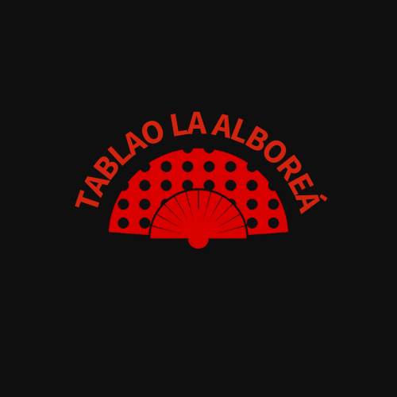
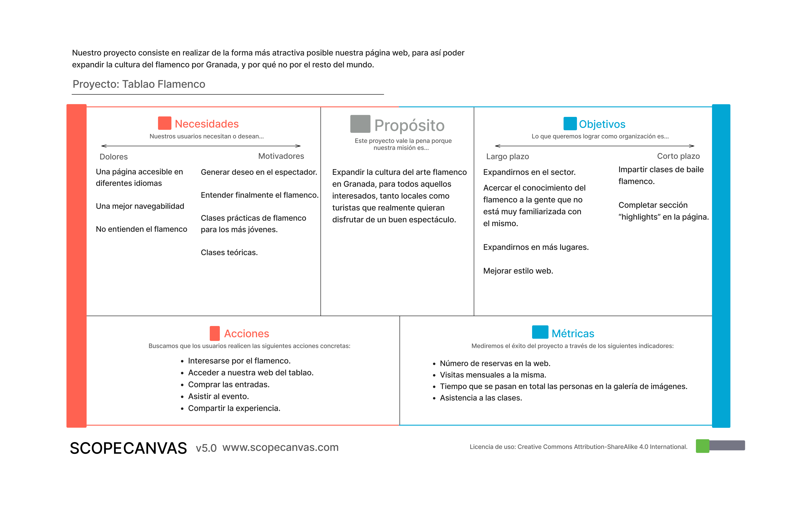
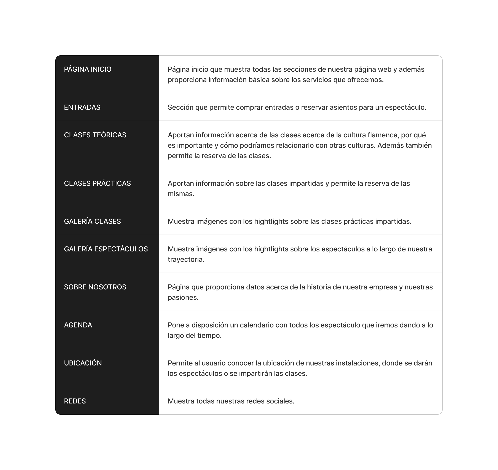
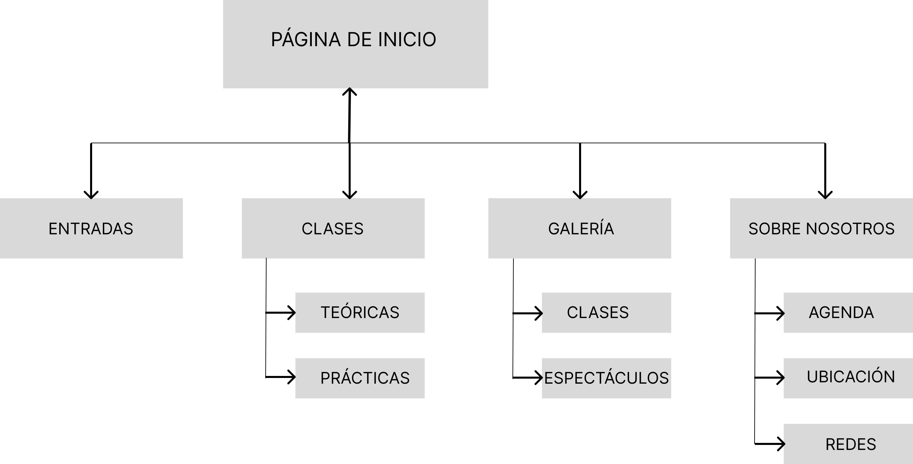
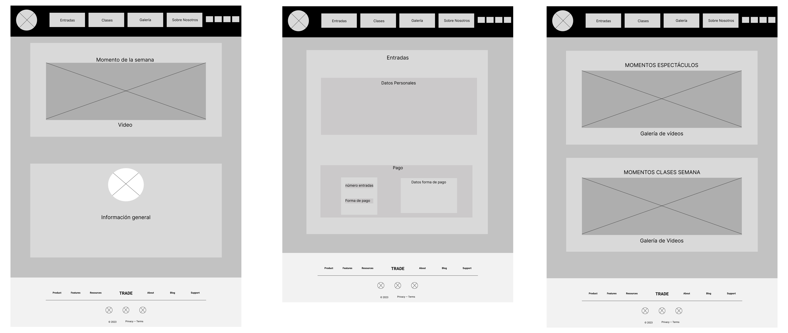
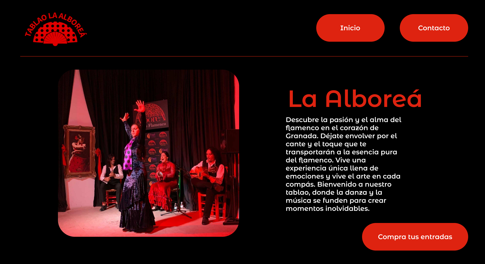

# DIU23
Prácticas Diseño Interfaces de Usuario 2022-23 (Tema: Tablao Flamenco ) 

Grupo: DIU1_03_70enbanca.  Curso: 2022/23 
Updated: 15/05/2023

<h1> Banca Flamenco </h1>

<h2> Descripción: </h2>

Nuestra idea es querer llevar el flamenco más allá de las limitaciones que había establecidas hasta ahora para este arte tan bonito; queremos diseñar una web que pueda llegar a la mayor cantidad de personas posibles, ofreciendo clases, hightlights, etc. Además de que queremos que el flamenco sea para todo el mundo, no solo para unos pocos, por eso queremos tratar de enseñarlo de una forma sencilla para los más nuevos pero sin perder la esencia del auténtico flamenco.

Logotipo: 

 

Miembros
 * :bust_in_silhouette:   Ismael Díaz Díaz    @MiixZ :octocat:     
 * :bust_in_silhouette:  Jordi Pereira Gil    @PepeProgrammer :octocat:

----- 

# Proceso de Diseño 

## Paso 1. UX Desk Research & Analisis 

 1.a Competitive Analysis
-----

Hemos elegido centrarnos en diferentes páginas que ofrezcan servicios para asistir a espectáculos de Tablao Flamenco en Granada, comparando entre ellas diferentes aspectos y así poder llegar en primera instancia a una conclusión con la que podamos trabajar, de cara a ver cómo y dónde centrarnos a la hora de diseñar la nuestra propia. Las diferentes páginas que hemos elegido son las que creemos líderes en el sector, por lo que es un plus a la hora de analizarlas. (Véase p1/CompetitiveAnalysis).

 1.b Persona
-----

Hemos escogido a María Hashimoto, una nativa española con ascendencia japonesa que nunca se ha sentido interesada por el flamenco.

También hemos escogido a Christian Giggs, un filósofo británico al que le gusta expandir sus conocimientos.

 1.c User Journey Map
----

Hemos escogido la misma experiencia para ambos (comprar entradas), vistas desde una perspectiva y motivo distintos, pues es lo más habitual que un usuario podría hacer a la hora de comprar las entradas para un espectáculo en una página como la nuestra.

## Cristian: 

## María:

 1.d Usability Review
----
¿Cómo podemos valorar a modo de clasificación esta página?
 - Enlace al documento:  [(P1/Usability review/Usability\ review\ p1.pdf)](https://github.com/MiixZ/DIU/blob/acdf01415fb9da4a44c786ee8027d9a53bacb0c4/P1/Usability%20review/Usability%20review%20p1.pdf) 
 - Valoración final (numérica): 7
 - Comentario sobre la valoración: 

## Paso 2. UX Design  

 2.a Feedback Capture Grid
Críticas, propuestas interesantes, preguntas en base a la experiencia y nuevas ideas que puedan surgir en nuestro proyecto.

    
¿Qué planteas como "propuesta de valor" para un nuevo diseño de aplicación para economía colaborativa?
Experiencia única de flamenco: Generar deseo en el espectador, entender la cultura del flamenco, compartir opiniones y discutir, poder participar; tenemos que hacer del flamenco algo memorable.

 2.b ScopeCanvas
----
Tenemos que expandir la propuesta de valor descrita anteriormente, de la siguiente manera:

 2.b Tasks analysis 
-----

"User Map" es una representación visual del recorrido de un usuario a través de un sistema. "Task Flow" es una secuencia de pasos que un usuario sigue para completar una tarea específica. Ambos ayudan a comprender la experiencia del usuario y mejorar el flujo de trabajo. A continuación, mostraremos una matriz donde se verá la interacción de los usuarios con diferentes tareas:

 2.c IA: Sitemap + Labelling 

En cuanto al labelling y al site map: 

 2.d Wireframes
-----

Este es el diseño general de la estructura de la visión en un dispositivo móvil:

## Paso 3. Mi UX-Case Study (diseño)

 3.a Moodboard
-----

  3.b Landing Page
----

De una forma artística y llegadera, utilizando los clásicos y tradicionales colores del flamenco y siguiendo la anterior moodboard:

 3.c Guidelines
----

Enlace al documento donde especificamos las guidelines de nuestro proyecto: [Guidelines](P3/Guidelines.pdf)

  3.d Mockup
----

>>> Layout: Mockup / prototipo HTML (que permita simular tareas con estilo de IU seleccionado)

 3.e My UX-Case Study

He aquí una demo de forma visual y práctica de nuestro prototipo.

https://github.com/MiixZ/DIU/assets/76443984/98cc978f-8115-42d0-acd2-7aa53cb09414

## Paso 4. Evaluación 

 4.a Caso asignado
----

Nos ha tocado evaluar al grupo "DIU2.LosEvarers", que han realizado la página Unlock Granada, orientada al turismo y conocer la cultura de la ciudad de una forma interactiva y entretenida. Evaluaremos su forma de diseñarla y llevar a cabo su funcionalidad, testeando principalmente cómo de accesible es para tipos concretos de personas.

De forma equivalente, evaluaremos también nuestro site, siendo nuestro prototipo el llamado "A", y el asignado el llamado "B".

 4.b User Testing
----

Estas serán las personas ficticias que probarán los sites:

. 4.c Cuestionario SUS
----

Usaremos el **Cuestionario SUS** para valorar la satisfacción de cada usuario con el diseño (A/B) realizado. Para ello usamos la [hoja de cálculo](https://github.com/mgea/DIU19/blob/master/Cuestionario%20SUS%20DIU.xlsx) para calcular resultados siguiendo las pautas para usar la escala SUS e interpretar los resultados
http://usabilitygeek.com/how-to-use-the-system-usability-scale-sus-to-evaluate-the-usability-of-your-website/)

 4.d Usability Report
----

El usability report en cuestión está ubicado en el directorio P4/P4_UsabReport_UnlockGranada_doneby_DIU2.LosEvarers_DIU1.03_70enbanca.pdf
Un enlace directo: https://github.com/MiixZ/DIU/blob/master/P4/P4_UsabReport_UnlockGranada_doneby_DIU2.LosEvarers_DIU1.03_70enbanca.pdf

## Conclusión final / Valoración de las prácticas

>>> (90-150 palabras) Opinión del proceso de desarrollo de diseño siguiendo metodología UX y valoración (positiva /negativa) de los resultados obtenidos.

La práctica que hemos experimentado resulta entretenida y nos permite obtener una perspectiva distinta de la informática. En este ámbito, no todo se reduce a programar en bajo y alto nivel, ya que eso se limitaría a un grupo reducido de programadores. El propósito de este mundo tecnológico va más allá. Buscamos trascender, explorar nuevas posibilidades y desafiar los límites establecidos. No se trata únicamente de dominar un lenguaje de programación, sino de comprender la influencia de la tecnología en nuestra sociedad y cómo podemos utilizarla de manera creativa para impulsar el progreso y mejorar la vida de las personas. Esto también incluye a personas con ciertos problemas o discapacidades, que se recogen en el ámbito de la accesibilidad, punto también muy importante que hemos estudiado.

